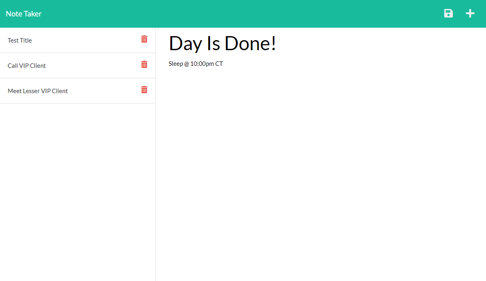

[](https://opensource.org/licenses/MIT)
  
# Note Taker

## Link to public repo on Github:

https://github.com/jcapadocia3/Note-Taker

## Link to Deployed Heroku App

https://nu-note-taker.herokuapp.com/

## Table of Contents
1. [Description](#Description)
2. [Final Product Image](#Final-Product-Image)
3. [User Story](#User-Story)
4. [Installation and Instructions](#Instructions)
5. [License](#License)
6. [Questions](#Questions)

## Description
The purpose of this project is to allow a user to write and save notes to be stored in a database hosted by a local server using the Express package via an "npm install" command.

## Final Product Image

- Image of final product website created<br>




## User Story
```
GIVEN a note-taking application

WHEN I open the Note Taker
THEN I am presented with a landing page with a link to a notes page

WHEN I click on the link to the notes page
THEN I am presented with a page with existing notes listed in the left-hand column, plus empty fields to enter a new note title and the note’s text in the right-hand column

WHEN I enter a new note title and the note’s text
THEN a Save icon appears in the navigation at the top of the page

WHEN I click on the Save icon
THEN the new note I have entered is saved and appears in the left-hand column with the other existing notes

WHEN I click on an existing note in the list in the left-hand column
THEN that note appears in the right-hand column

WHEN I click on the Write icon in the navigation at the top of the page
THEN I am presented with empty fields to enter a new note title and the note’s text in the right-hand column
```

## Instructions
- Visit [Deployed Heroku App](#Link-to-Deployed-Heroku-App) URL provided above
- Enjoy using the app!

## License
- MIT License
- Copyright 2021

    Permission is hereby granted, free of charge, to any person obtaining a copy of this software and associated documentation files (the "Software"), to deal in the Software without restriction, including without limitation the rights to use, copy, modify, merge, publish, distribute, sublicense, and/or sell copies of the Software, and to permit persons to whom the Software is furnished to do so, subject to the following conditions:
    
    The above copyright notice and this permission notice shall be included in all copies or substantial portions of the Software.
    
    THE SOFTWARE IS PROVIDED "AS IS", WITHOUT WARRANTY OF ANY KIND, EXPRESS OR IMPLIED, INCLUDING BUT NOT LIMITED TO THE WARRANTIES OF MERCHANTABILITY, FITNESS FOR A PARTICULAR PURPOSE AND NONINFRINGEMENT. IN NO EVENT SHALL THE AUTHORS OR COPYRIGHT HOLDERS BE LIABLE FOR ANY CLAIM, DAMAGES OR OTHER LIABILITY, WHETHER IN AN ACTION OF CONTRACT, TORT OR OTHERWISE, ARISING FROM, OUT OF OR IN CONNECTION WITH THE SOFTWARE OR THE USE OR OTHER DEALINGS IN THE SOFTWARE.

## Questions
- GitHub Profile: <a href="https://github.com/jcapadocia3">jcapadocia3</a><br>
- My Email: james.capadocia@gmail.com<br>
***Please feel free to contact me for more information***